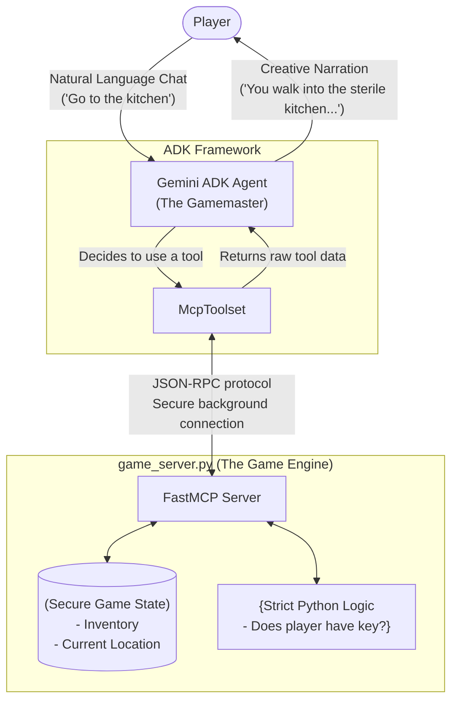

# The House Treasure Hunt Architecture

This document breaks down exactly how the House Treasure Hunt is built to be a resilient, 5-minute interactive chat game.

## Architecture Diagram
The core philosophy is separating the creative narrative (handled by the LLM) from the rigid game rules (handled by Python).

## How This Achieves the 5-Minute Game Goal
By structuring the game this way, we guarantee it can be played quickly and perfectly without the AI breaking the immersion. 

1. **The Game Engine (Python)** acts as an infallible referee. If the game is meant to take 5 minutes, we ensure the player actually has to spend those 5 minutes searching rooms instead of just sweet-talking the AI into giving them the treasure immediately.
2. **The Gamemaster (Gemini)** doesn't have to waste brainpower trying to remember what items the player has picked up. It simply passes user intents through the `McpToolset` bridge and focuses 100% of its processing power on generating beautiful, cinematic text descriptions when the Python engine gives it back the raw data.
